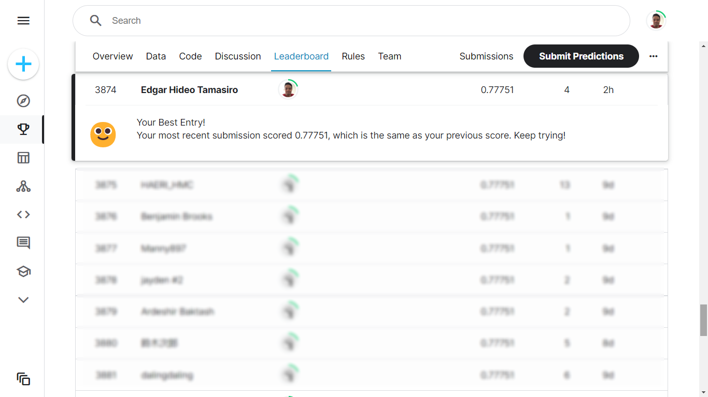

DESAFIO TITANIC KAGGLE

Minha resolução para o desafio do Kaggle de predição de sobreviventes e não-sobreviventes do Titanic.

Foram utilizados os modelos de ML: Random Forests, Decision Trees, Logistic Regression, K-Neighbours, GaussianNB, SVM, Stochastic Gradient e Gradient Boost.

Para todos foram feitos treino e validação cruzada, sendo o de melhor performance o modelo Gradient Boost e o escolhido para tuning de parâmetros e emprego nos dados de teste.

Segue print do rank após submissão do arquivo.

